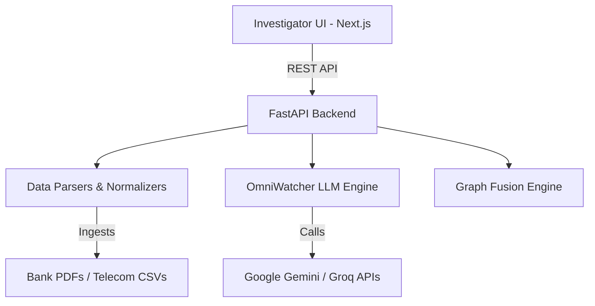

<div align="center">
  
  <h1>Trinetra Forensiq</h1>
  <p><b>AI-Powered Cyber Crime Investigation & OSINT Telemetry Platform</b></p>

  [](https://python.org)
  [](https://nextjs.org)
  [](https://fastapi.tiangolo.com)
  [](LICENSE)
</div>

---

**Trinetra Forensiq** is a next-generation investigative copilot designed for law enforcement and cybersecurity professionals. By leveraging Large Language Models (LLMs) and advanced graph analytics, Trinetra automates the ingestion, parsing, and fusion of complex digital footprints—including bank statements, Call Detail Records (CDRs), and IPDRs—into actionable intelligence.

## ✨ Key Features

- **Automated Data Ingestion**: Seamlessly parse complex PDFs and CSVs (Bank Statements, CDRs, IPDRs).
- **AI-Powered Graph Fusion**: Automatically correlate identities across disparate data sources to detect money laundering, fraud rings, and illicit networks.
- **OmniWatcher AI System**: Dual-provider fallback (Gemini Primary, Groq Backup) for resilient natural language queries against your evidence graph.
- **Investigative Copilot (UI)**: An intuitive, Next.js 15+ frontend offering 3D/2D node visualization, evidence timelines, and conversational analytics.
- **Cloud-Native Architecture**: Fully containerized and optimized for decoupled deployment (Render/Vercel) or local Docker environments.

---

## 🏗 Architecture

Trinetra utilizes a modern, decoupled microservices architecture:

- **Backend**: FastAPI (Python 3.13), XGBoost for behavioral risk scoring, NetworkX for graph traversal, and multi-modal LLM integration.
- **Frontend**: Next.js (App Router), React 19, Zustand for state management, TailwindCSS, and Three.js for network visualizations.



---

## 🚀 Quick Start (Local Docker)

The easiest way to run Trinetra Forensiq locally is via Docker Compose.

### 1. Prerequisites
- [Docker & Docker Compose](https://docs.docker.com/get-docker/)
- LLM API Keys (Google Gemini or Groq)

### 2. Setup

Clone the repository and configure your environment:

```bash
git clone https://github.com/gitkrypton18/Trinetra-Forensiq.git
cd Trinetra-Forensiq

# Create your .env file
cp .env.example .env

# Edit .env and set APP_SECRET and your LLM API Keys
```

### 3. Launch

```bash
docker-compose up --build
```
The application will be available at `http://localhost:3000` (Frontend) and `http://localhost:8000/docs` (Backend API).

---

## ☁️ Cloud Deployment (Render & Vercel)

Trinetra is optimized for scalable cloud deployments. 

1. **Backend (Render)**: Connect this repository to Render as a Docker Web Service. Set your `APP_SECRET` and API keys in the Render dashboard environment variables. Ensure it exposes port `10000` (or Render's default).
2. **Frontend (Vercel)**: Connect this repository to Vercel, targeting the `/frontend` directory. Add `NEXT_PUBLIC_API_URL` pointing to your Render backend URL.
3. **CORS**: Once Vercel is deployed, lock down your Render `APP_CORS_ORIGINS` to only accept requests from your Vercel domain.

---

## 🛡 Security & Compliance

Trinetra processes sensitive investigative data. 
- **Stateless Architecture**: By default, data is stored in ephemeral memory graphs or the local `/app/data` volume. No databases are exposed.
- **JWT Auth**: Secured by short-lived JWTs and hashed credentials.
- **Zero-Telemetry**: The Next.js frontend has Next.js telemetry disabled by default for air-gapped security.

*Disclaimer: Ensure compliance with local laws (e.g., GDPR, CCPA) when handling real-world PII or telecommunications data.*

---

## 📄 License

This project is licensed under the MIT License - see the [LICENSE](LICENSE) file for details.
